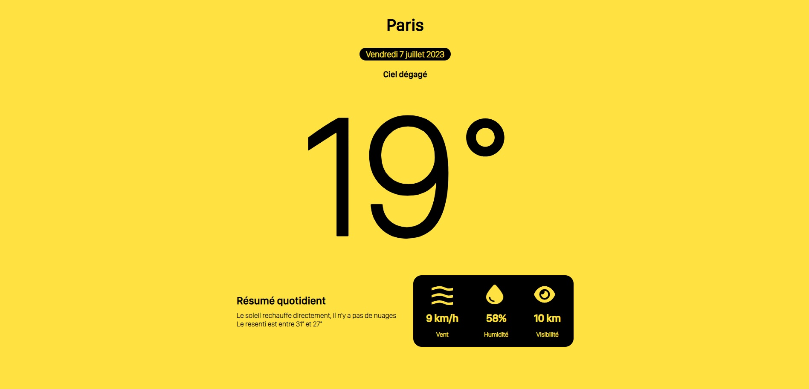

# weather-app

A little website to show the weather of differents city in the world



#### USING LIBS AND FRAMEWORK
- VueJS 3
- SwiperJS
- Axios

## TO DO

- [X] Vue template clean
- [X] Global layout and css
- [X] A slider for the multiple city
- [X] Connection to API openweather
- [X] Get data and show it ( mainly )
- [ ] Connection to traduction API
- [ ] desciption of the day
- [ ] Animations CSS
- [ ] Sidebar with city fastaccess
- [ ] Add city fonctions in sidebar
- [ ] DB for stats 
- [ ] Optimisations of algorithms

## Project Setup

```sh
npm install
```

## Make a conf.json file at the root of the folder

```sh
{
    "apikey" : "ofdvkwdp,sùsm,qùfddsfô"
}
```

### Compile and Hot-Reload for Development

```sh
npm run dev
```

### Compile and Minify for Production

```sh
npm run build
```

